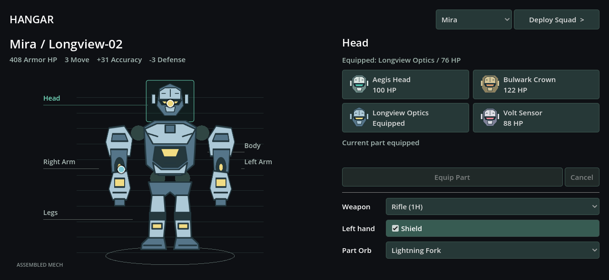
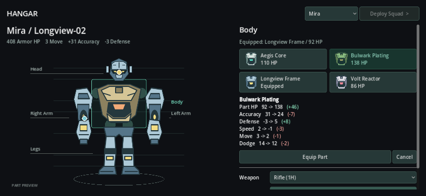

# Visual Hangar v0.1

Issue #58 replaces the form-like preparation screen with spatial mech editing. The normal preparation entry scene and authoritative build model are unchanged.

## Interaction

- Select a pilot from the header; the assembled mech and overall part stats remain visible on the left.
- Select Head, Body, Right Arm, Left Arm or Legs on the illustration. Arm labels use the mech's anatomical sides in a front view.
- Illustrated alternatives on the right show names, durability and which part is equipped.
- Selecting an alternative previews its silhouette and color without modifying the build. Numeric before/after values show every changed stat; signed differences and colors distinguish improvements from costs.
- Equip commits the candidate. Cancel, another part or another pilot dismisses it. Deployment is disabled while a preview is unresolved.
- Weapon, Shield and the selected part's Orb remain editable below the comparison. Both-arm weapon restrictions are visible. Colored Orb sockets sit on the visible armor of their installed part rather than at the selection-box edge.

## Assets and Ownership

`assets/hangar/` contains 16 original graybox SVG illustrations, four part silhouettes for each equipment family. Arms are mirrored for anatomical placement. Bulwark uses larger plates and treads, Longview has narrower precision components, Aegis uses balanced armor and Volt uses lightweight components. Guard and Sprinter reuse related family placeholders. These are identity aids, not final production art or new gameplay rules.

`src/ui/mech_assembly_view.gd` owns composition, illustration lookup and spatial selection. `hangar_editor.gd` owns candidate inspection and confirmation; authoritative deltas and swaps remain in `MechBuildModel`.

## Verification

54 Python tests pass; Godot acceptance and 95.9% function coverage pass. Acceptance covers selection through the part button, nonmutating preview, numeric comparison, Cancel, Equip, deployment gating and the existing battle-return flow. Rendered 1280x590 and 844x390 views were inspected, including a six-stat body comparison. The inspector scrolls vertically when the full comparison and equipment controls exceed its height; the mech stays visible.

Reproduce screenshots with `tools/capture_phase2_flow.gd`. This is automated developer verification; human usability feedback remains open.

